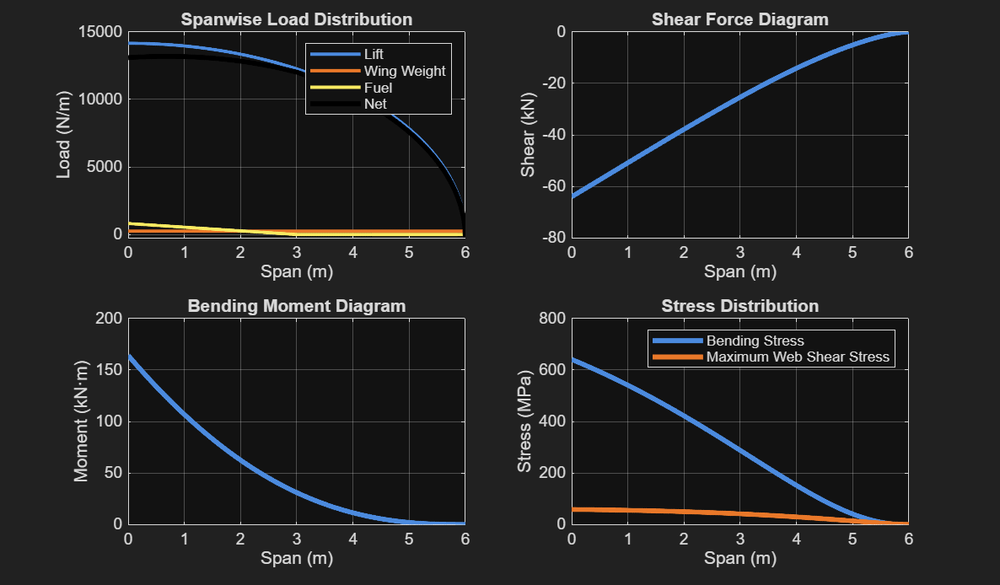
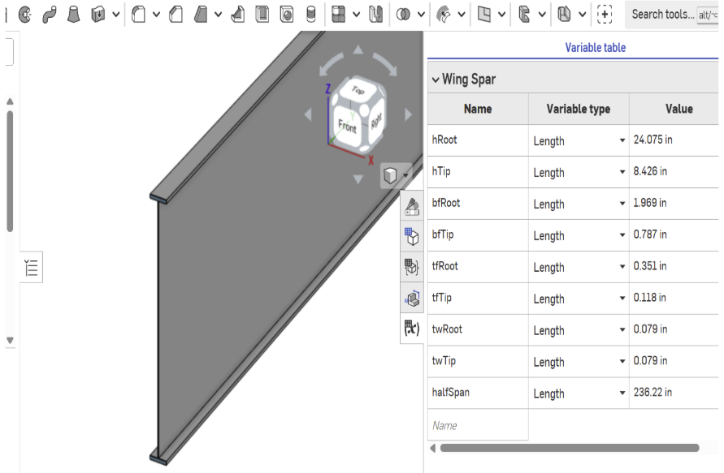
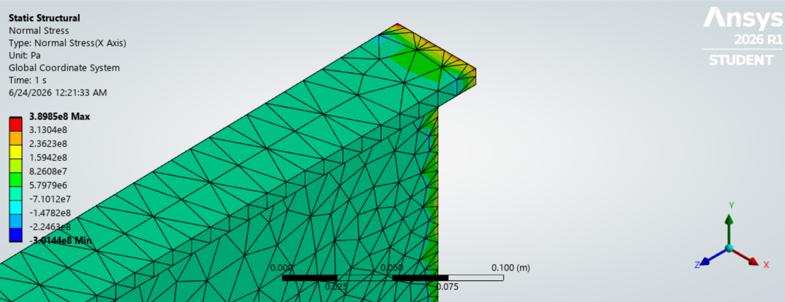

# Geometrically Constrained Aero-Structural Optimization of a Tapered Wing Spar

An independent, multi-disciplinary engineering project spanning **Analytical Modeling**, **Numerical Optimization**, **Parametric CAD**, and **Finite Element Analysis (FEA)** verification. Completed prior to undergraduate sophomore year.

---

## 🔗 Project Access
* **Interactive 3D CAD Model:** [View in OnShape](https://cad.onshape.com/documents/11e77654504bcf3315e401bc/w/a89d47cc6d5e61272868f923/e/67b0730050a7a05215266d8f)
* **Full Documentation:** [Read Project Report on Google Drive](https://docs.google.com/document/d/1psWOd0Y93U4HUpR2GLSO6a351BUzJQ_L_E0h62fA0Fk/edit?usp=sharing)

---

## 📌 Project Overview
This project establishes an end-to-end engineering workflow to minimize the weight of a general aviation aircraft semi-span wing spar (4,000 lb gross weight, 3.75g ultimate load factor) while strictly satisfying localized material yield strength, tip deflection limits, and geometric manufacturing constraints.

The workflow is divided into three interconnected phases:
1. **Phase 1: Analytical Model & Optimization (MATLAB):** Modeled the loading environment using Euler-Bernoulli beam theory and solved a constrained optimization loop using Sequential Quadratic Programming (`fmincon`).
2. **Phase 2: Parametric CAD Synthesis (OnShape):** Translated optimization variables into a continuously tapered, variable-driven 3D I-beam geometry.
3. **Phase 3: FEA Verification (ANSYS Mechanical):** Conducted full 3D solid structural simulations and a mesh convergence study to validate the 1D mathematical assumptions.

---

## 🛠️ Detailed Methodology & Results

### Phase 1: Analytical Model & Optimization (MATLAB)
* **Aerodynamic Loading:** Modeled a continuous lift distribution discretized across 1,000 spanwise stations, factoring in concentrated structural deadweight and fuel weight.
* **Optimization Framework:** Formulated a nonlinear programming problem solved via MATLAB’s `fmincon` (SQP algorithm).
* **Constraints:** Active bounds on material yield strength ($\sigma_y = 434 \text{ MPa}$), maximum tip deflection ($\delta_{\max}$), web buckling/shear, and geometric taper limits.
* **Result:** Achieved a highly optimized structural mass of **21.04 kg**.

<p align="center">
  
  <br><i>Figure 1: Numerical loading profiles and stress distribution along the spar span.</i>
</p>

---

### Phase 2: Parametric CAD Synthesis (OnShape)
To ensure seamless design propagation from math to model, the optimized root and tip dimensions generated in MATLAB were fed into OnShape. 
* Utilized **Variable Studios** and feature-linking to drive sketches.
* Modeled a continuously tapered, variable-flange, and variable-web I-beam spar.
* The model scales parametrically without breaking, bridging the gap between calculation and physical layout.

<p align="center">
  
  <br><i>Figure 2: Parametric, continuously tapered 3D wing spar geometry.</i>
</p>

---

### Phase 3: FEA Verification (ANSYS Mechanical)
To test the validity of the 1D Euler-Bernoulli assumptions, the parametric model was imported into ANSYS Mechanical for 3D solid structural validation under equivalent distributed aerodynamic loads.
* **Mesh Convergence Study:** Evaluated structural metrics across multiple element sizes to ensure asymptotic convergence of peak stresses.
* **Correlation Analysis:** The simulation confirmed analytical limits, with a minimal 23.4% discrepancy in tip deflection due to localized 3D shear deformation effects neglected by 1D beam theory.

<p align="center">
  
  <br><i>Figure 3: Von Mises stress mapping highlighting structural integrity under ultimate load.</i>
</p>

---

## 📂 Repository Structure
```text
├── README.md               # Project landing page & executive summary
├── src/                    
│   └── optimization_loop.m # MATLAB optimization code using fmincon
├── cad/                    
│   └── wing_spar.x_t       # Exported Parasolid/STEP CAD geometry
└── images/                 # Plots, CAD renders, and FEA heatmaps
